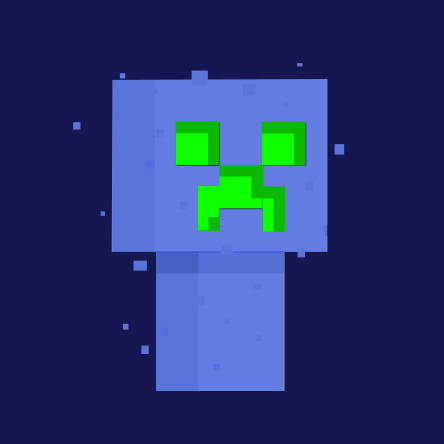
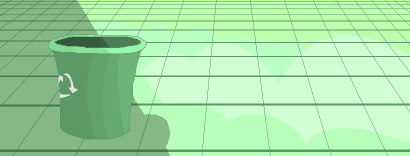

# Hi there, I'm Daniel Stephen Alvarez! 👋

  

I'm an IT student passionate about:

**Web Development**
**Software Development**
**Digital Art/Graphics**
**3D Modeling and Animation**

## 🌱 Currently Learning

### Languages

|  |  |  |  |  |
|:---:|:---:|:---:|:---:|:---:|
| Java | Kotlin | JavaScript | Lua | C# |

### Web Technologies

|  |  |  |  |  |  |
|:---:|:---:|:---:|:---:|:---:|:---:|
| React.js | Node.js | Express.js | Firebase | AWS | Google Cloud |

### Databases

|  |  |
|:---:|:---:|
| SQL | NoSQL |

### Tools

|  |  |  |  |  |  |
|:---:|:---:|:---:|:---:|:---:|:---:|
| Visual Studio | VS Code | Unity | Git | GitHub | Plastic SCM |

|  |  |  |  |  |
|:---:|:---:|:---:|:---:|:---:|
| Bridge | Blender 3D | Blockbench | Krita | Inkscape |

### Others

- JSON
- 3D Modeling
- 3D Animation
## 📈 GitHub Stats

## 🔗 Connect with Me

## 🚀 Projects

Here are some of my notable projects:

- **Roblox Game:** A custom game developed using Lua in Roblox Studio. [Try Playing Now](https://ro.blox.com/Ebh5?af_dp=roblox%3A%2F%2Fnavigation%2Fgame_details%3FgameId%3D6116228439&af_web_dp=https%3A%2F%2Fwww.roblox.com%2Fgames%2F17851222097)
- **Minecraft Bedrock Addon:** An addon enhancing gameplay mechanics. // To be posted on Marketplace soon!!
- **Capstone Project:** A web application built with React.js and an Android app developed in Unity. // Under development!!

  

