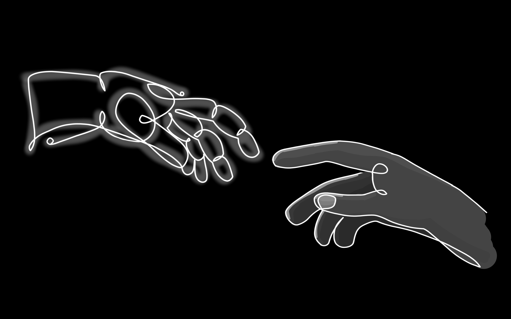

  

  <h1>Hello! I'm Daniel Stephen Alvarez 👋</h1>
  
  <h3>Full-Stack Developer | Creative Technologist | Digital Artist</h3>

  
Passionate about crafting seamless digital experiences across web and mobile platforms

  
🌠<b>Full-Stack Development</b> | 
  📱 <b>Mobile Applications</b> | 
  🎮 <b>Game Development</b> | 
  🨠<b>Digital Art & 3D Design</b>

## 🚀 What I Do

I'm a full-stack developer specializing in modern web and mobile applications. Currently working on projects that span across platforms, from responsive web apps to native mobile experiences.

**Current Focus:**
- Building scalable web applications with **React.js** and **Firebase**
- Developing mobile apps using **Kotlin Compose** for Android
- Creating seamless user experiences across different platforms
- Exploring AR/VR technologies and their practical applications

## 🛠️ Tech Stack & Skills

| **Frontend** | **Backend & Cloud** | **Mobile** | **Creative Tools** |
|--------------|---------------------|------------|-------------------|
|     |      |    |   |

| **Databases** | **Languages** | **Tools & IDEs** | **Other Skills** |
|---------------|---------------|------------------|------------------|
|    |     |    | 🯠RESTful APIs 🔄 Git Version Control 📱 Responsive Design 🨠UI/UX Design |

## 💼 Featured Projects

### 🏥 AidMentor - AR First Aid Companion
*Capstone Project | React.js + Unity AR*

An innovative Augmented Reality application that provides real-time first aid guidance for physical ailments. Features a comprehensive web dashboard built with React.js and an immersive AR mobile experience developed in Unity.

**Key Features:**
- Real-time AR object recognition and guidance
- Comprehensive first aid database
- Cross-platform compatibility
- Intuitive user interface design

 
   

### 🎮 RPG Adventure Game
*Game Development | Roblox Platform*

A fully-featured RPG game with 6 unique character classes, each with distinct abilities and playstyles. Currently in active development with regular updates and community engagement.

**Classes Available:**
- ⚔️ Assassin - Stealth and precision attacks
- 🪓 Barbarian - Raw strength and berserker rage
- 🛡️ Dwarven Warrior - Defensive specialist
- 🗡️ Knight - Balanced offense and defense
- 👑 Mega Knight - Heavy armor and powerful strikes
- 🏹 Spearman - Ranged combat expertise

[🎮 Play Now](https://ro.blox.com/Ebh5?af_dp=roblox%3A%2F%2Fnavigation%2Fgame_details%3FgameId%3D6116228439&af_web_dp=https%3A%2F%2Fwww.roblox.com%2Fgames%2F17851222097)

  

### 📦 Minecraft Content Creation
*Creative Development | Marketplace Publisher*

Creator and developer of various Minecraft Bedrock content including addons, maps, and custom experiences available on the official Minecraft Marketplace.

[🎯 Visit Our Marketplace](https://www.minecraft.net/en-us/marketplace/creator?name=delisoft%20studios)

## 🎨 Creative Work

Combining technical skills with artistic vision to create compelling digital experiences:

  
  
  

## 📊 GitHub Analytics

  
  

  

## 🌟 Currently Working On

- 🔧 **Enterprise Web Application** - React.js with Firebase backend
- 📱 **Mobile App Development** - Native Android with Kotlin Compose
- 🎮 **Game Feature Updates** - Expanding RPG mechanics and content
- 🎨 **3D Animation Projects** - Character modeling and environmental design

## 📫 Let's Connect!

I'm always interested in collaborating on innovative projects or discussing new opportunities in full-stack development, mobile applications, or creative technology.

  
  
  

  

---

  <i>"Building the future, one line of code at a time."</i>

